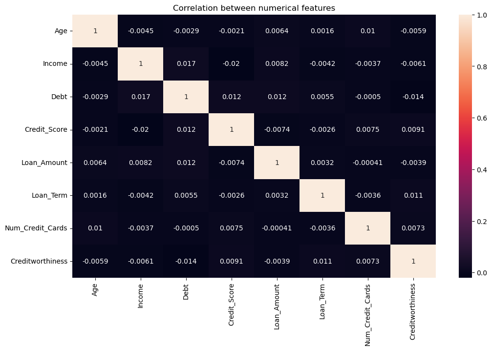

# 💳 codealpha_ml_project1_Creditworthiness_Prediction  

---

## 📌 Project Overview  
This is my **first project** during the **Machine Learning Internship @ CodeAlpha**.  
The **main objective** of this project was to predict whether an individual is **creditworthy** or not, based on financial and demographic features, using **machine learning classification models**.  

The workflow included:  
- **Data preprocessing** (handling missing values & encoding categorical variables)  
- **Handling imbalanced data** to improve model performance  
- **Exploratory Data Analysis (EDA)** for feature understanding and correlations  
- **Feature engineering** to enhance predictive power  
- **Model training & evaluation** using multiple algorithms (Logistic Regression, Decision Tree, Random Forest, SVM, XGBoost, LightGBM)  
- **Hyperparameter tuning** with both **RandomizedSearchCV** and **GridSearchCV**  

This project highlights the role of ML in **financial risk assessment and decision-making**.  

---

## 📊 Dataset Overview  
- **Dataset:** [Creditworthiness Dataset](Dataset)  
- **Target Variable:** `Creditworthy` (1 = Good, 0 = Bad)  
- **Features:** Age, Income, Employment Status, Credit History, Loan Amount, Duration, etc.  
- **Size:** 12000  records. 

---

## 🛠️ Methodology & Workflow  

1. **Data Preprocessing**  
   - Checked missing values & cleaned dataset  
   - Encoded categorical variables  
   - Applied feature scaling when required  
   - Train-test split → divided data into training & testing sets  

2. **Handling Imbalanced Data**  
   - Tried **SMOTE** for synthetic data generation, but results were not optimal.  
   - Applied **RandomOverSampler**, which provided better performance and improved model accuracy.  

3. **Exploratory Data Analysis (EDA)**  
   - Distribution plots of financial attributes  
   - Correlation heatmap between features & target  
   - Countplot of target variable (creditworthy vs non-creditworthy)  
   - Boxplots to compare income, loan amount, and duration across creditworthiness classes  

4. **Model Training**  
   - Perceptron
   - Logistic Regression
   - K-Nearest Neighbors (KNN)
   - Decision Tree  
   - Random Forest  
   - Support Vector Machine (SVM)  
   - XGBoost Classifier  
   - LightGBM Classifier
   - Catboost Classifier

5. **Hyperparameter Tuning**  
   - Used **RandomizedSearchCV** for initial tuning  
   - Refined models with **GridSearchCV** for best parameters  

6. **Evaluation**  
   - Metrics: **Accuracy, Precision, Recall, F1-Score, ROC-AUC**  
   - Compared results across all models  

---

## 🚀 Results  

- **Best Model:** Random Forest (with tuned hyperparameters)  
- **Best Accuracy:** 84%  

📊 Performance comparison table:

| Model               | Train Accuracy | Test Accuracy |
|---------------------|----------------|---------------|
| Logistic Regression | 0.52           | 0.51          |
| Decision Tree       | 1.00           | 0.78          |
| Random Forest ✅     | **1.00**       | **0.88 (overfitting)**      |
| SVM                 | 0.52           | 0.50          |
| XGBoost             | 0.93           | 0.74          |
| LightGBM            | 0.85           | 0.67          |

---

## 📊 Visualizations (Sample)  

### 2. Correlation Heatmap  
  

### 3. Creditworthiness Distribution  
  

---

## 💡 Key Learnings  
- Handling **imbalanced data** is critical for fair model evaluation in financial datasets.  
- **RandomizedSearchCV → GridSearchCV** proved efficient for hyperparameter optimization.  
- **Random Forest & Boosting models** performed best, capturing complex patterns in the data.  
- Key predictors included **credit history, income, and loan amount**.  

---

## 📝 Author  
👤 **Abanoub Michel**  
📍 Machine Learning Intern @ CodeAlpha  

---
